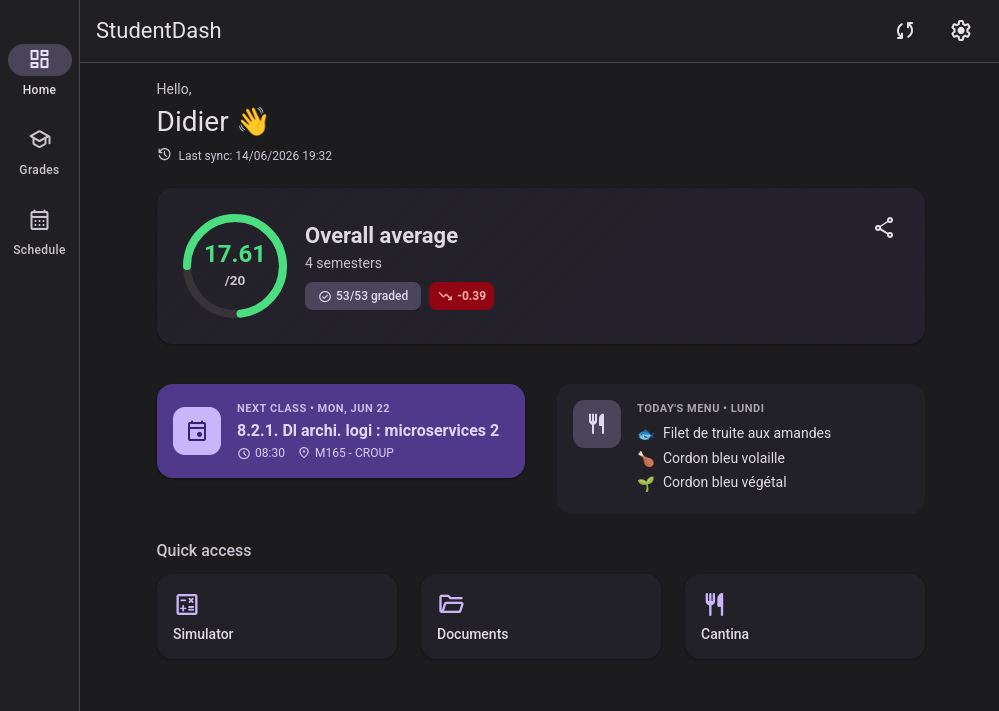
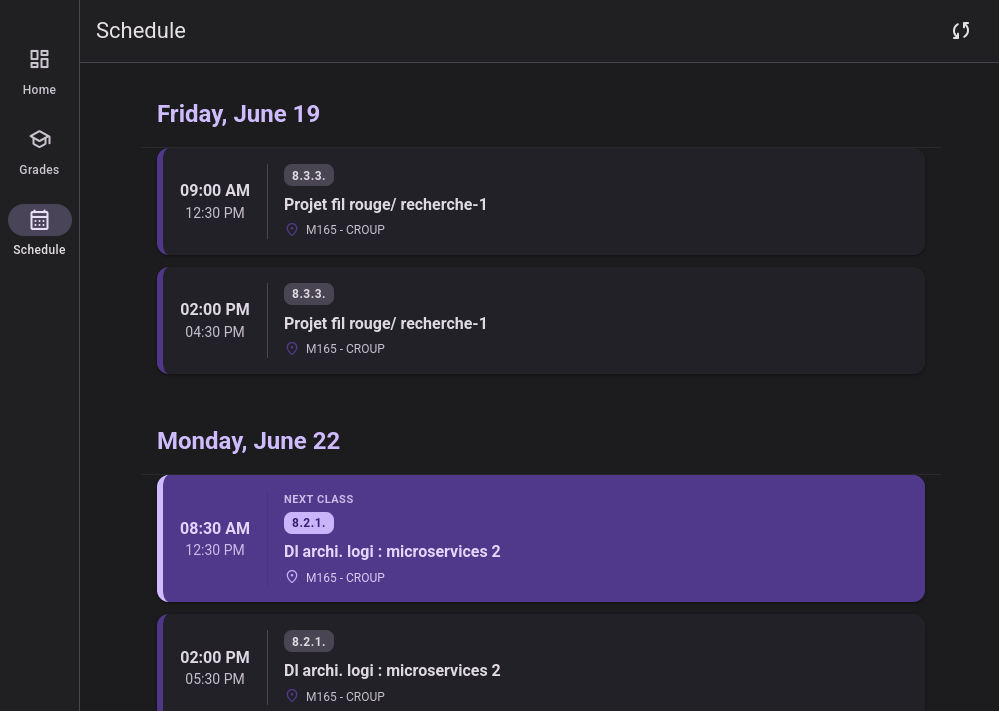
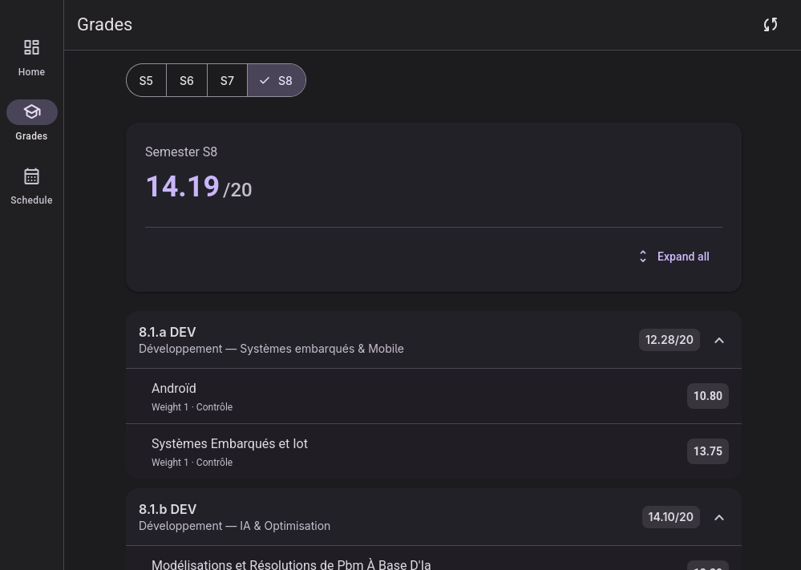

<div align="center">
  <h1>🎓 StudentDash</h1>
  <p>The Ultimate All-in-One Dashboard for Students.</p>

  [](https://nextjs.org/)
  [](https://www.prisma.io/)
  [](https://tailwindcss.com/)
  [](https://www.typescriptlang.org/)
  [](#license)
</div>

<br />

## 🌟 Overview

**StudentDash** is a modern, unified web platform designed to simplify student life. By gathering grades, academic schedules, daily cantina menus, and curriculum tracking into one sleek interface, it serves as the ultimate companion for academic success. 

Built with the latest technologies like Next.js, Prisma, and Tailwind CSS, it offers a blazing-fast, secure, and beautiful experience.

> ⚠️ **Disclaimer - Independent Project**
> StudentDash is a **strictly independent student project**, developed by a curious student wanting to improve and modernize the daily lives of their peers. 
> It is in no way affiliated with, sponsored, supported, or validated by **École des Mines d'Alès (IMT Mines Alès)** or any other official organization. It is primarily a non-profit personal project.

> 🔧 **Adaptability**
> Although this open-source version is initially customized for **École des Mines d'Alès** (specifically for scraping *CyberNotes*), the project is structured so that anyone can **fork it and adapt it for their own school or university!**

## 📸 Screenshots

<!-- Developer Note: Replace the image paths below with your own screenshots of the site -->
| Dashboard | Schedule | Grades & Curriculum |
| :---: | :---: | :---: |
|  |  |  |

<br />

## ✨ Features

- **🚀 Unified Dashboard**: Get a comprehensive overview of your academic day at a glance.
- **📈 Grades Management**: Automatic fetching and tracking of grades securely synced from the school portal.
- **📅 Smart Planning**: Real-time academic calendar and schedule integration (ICS parsing).
- **🍔 Cantina Menus**: Automated weekly updates on Crous / campus restaurant menus.
- **🔔 Push Notifications**: Stay updated with web push notifications for new grades and schedule changes.
- **📊 Curriculum Tracking & Simulator**: Track your progress through different paths and simulate the grades needed to validate your semester.
- **🔒 Secure by Design**: AES-256 encrypted credentials, and secure sessions via Auth.js (NextAuth).

## 🛠️ Tech Stack

- **Framework**: [Next.js](https://nextjs.org/) (App Router)
- **Database**: [PostgreSQL](https://www.postgresql.org/)
- **ORM**: [Prisma](https://www.prisma.io/)
- **Authentication**: [NextAuth.js (Auth.js)](https://authjs.dev/)
- **Styling**: [Tailwind CSS v4](https://tailwindcss.com/)
- **Web Scraping**: [Cheerio](https://cheerio.js.org/)
- **Notifications**: Web-Push integration

## 🚀 Getting Started

Follow these steps to set up the project locally.

### Prerequisites
- [Node.js](https://nodejs.org/) (v18 or higher)
- [npm](https://www.npmjs.com/) or [yarn](https://yarnpkg.com/)
- A PostgreSQL database (local or cloud)

### Installation

1. **Clone the repository:**
   ```bash
   git clone https://github.com/yourusername/StudentDash.git
   cd StudentDash/app
   ```

2. **Install dependencies:**
   ```bash
   npm install
   # or
   yarn install
   ```

3. **Set up environment variables:**
   Copy the `.env.example` file to create your own `.env` file, and fill in the required values (Database URL, NextAuth secrets, Google OAuth, etc.):
   ```bash
   cp .env.example .env
   ```

4. **Initialize the database:**
   ```bash
   npm run postinstall
   npx prisma db push
   ```

5. **Run the development server:**
   ```bash
   npm run dev
   ```

6. Open [http://localhost:3000](http://localhost:3000) with your browser to see the result.

## 🤝 Contributing

Contributions are always welcome! Feel free to open an issue or submit a Pull Request to improve the project.

1. Fork the Project
2. Create your Feature Branch (`git checkout -b feature/AmazingFeature`)
3. Commit your Changes (`git commit -m 'Add some AmazingFeature'`)
4. Push to the Branch (`git push origin feature/AmazingFeature`)
5. Open a Pull Request

## 📄 License

This project is licensed under the MIT License - see the [LICENSE](LICENSE) file for details.
